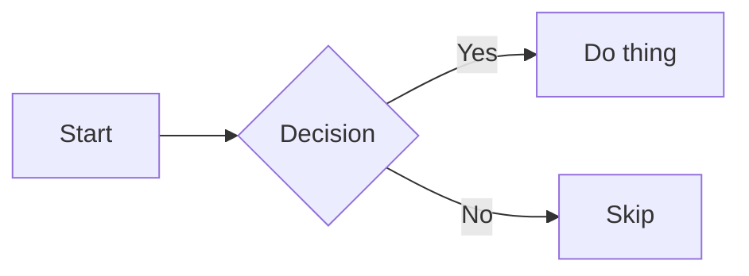

# sixel-graphics.nvim

Display images in Neovim using the sixel graphics protocol.

## Requirements

- Neovim >= 0.10.0
- A terminal that supports sixel
- [ImageMagick](https://imagemagick.org/) with sixel support
- [mmdr](https://github.com/1jehuang/mermaid-rs-renderer) for mermaid diagram rendering (recommended)
  ```bash
  cargo install mermaid-rs-renderer
  ```
- Or [mermaid-cli](https://github.com/mermaid-js/mermaid-cli) as an alternative renderer:
  ```bash
  npm install -g @mermaid-js/mermaid-cli
  ```

## Installation

Using [lazy.nvim](https://github.com/folke/lazy.nvim):

```lua
{
  "mammothb/sixel-graphics.nvim",
  -- opts = {} is optional — plugin auto-initializes with defaults
}
```

## Configuration

`setup()` is optional — the plugin auto-initializes with defaults.
Call it only to override settings:

```lua
require("sixel-graphics").setup({
  scale = 0.5,
  max_width = 80,
})
```

Or use `vim.g` (Vimscript-compatible):

```lua
vim.g.sixel_graphics = {
  scale = 0.5,
}
```

All default values:

```lua
require("sixel-graphics").setup({
  -- Enable/disable image rendering at runtime
  enabled = true,

  -- Maximum display width in cells (nil = no limit)
  max_width = nil,
  -- Maximum display height in cells (nil = no limit)
  max_height = nil,

  -- Scale factor for rendered images (1.0 = original size)
  scale = 1.0,

  -- Default row offset for rendering (positive = push image down)
  y_offset = 0,

  -- Override terminal cell dimensions in pixels.
  -- Useful when TIOCGWINSZ reports wrong pixel sizes (e.g. SSH, tmux).
  -- nil = auto-detect via TIOCGWINSZ ioctl.
  cell_width_override = nil,
  cell_height_override = nil,

  -- Compensate for mismatch between terminal sixel density and text cell density.
  -- Set to 0.625 for Windows Terminal HiDPI, 1.0 for most other terminals.
  sixel_pixel_scale = 1.0,

  -- Delay (ms) after floating window creation before sending sixel data.
  -- One frame at 60Hz; increase if image renders behind the popup window.
  popup_render_delay_ms = 16,

  -- Debug logging
  debug = {
    enabled = false,
    level = "info", -- "debug" | "info" | "warn" | "error"
    file_path = nil, -- e.g. "/tmp/sixel-debug.log" (nil = stderr only)
  },

  -- Hover: automatically show images and diagrams on cursor hover in markdown files
  hover = {
    images = { enabled = true },   -- toggle image hover
    diagrams = { enabled = true }, -- toggle diagram hover
    debounce_ms = 150,             -- delay before showing popup after cursor settles
    max_screen_fraction = 0.5,     -- max fraction of screen the popup may occupy
    filetypes = { "markdown" },     -- filetypes to enable hover in
  },

  -- Mermaid diagram renderer options
  renderer_options = {
    mermaid = {
      renderer = "mmdr",  -- "mmdr" (native Rust, ~2-6ms) | "mmdc" (Node.js/Chromium, ~1-5s)

      -- Minimum popup width in cells (diagrams auto-size to content, enforce floor)
      min_popup_width = 40,

      mmdr = {
        width = nil,        -- nil | number (px)
        height = nil,       -- nil | number (px)
        fast_text = false,  -- use faster text rendering
        config_file = nil,  -- nil | path to mmdr config.json (bundled default has font settings)
      },

      mmdc = {
        theme = nil,        -- nil | "default" | "dark" | "forest" | "neutral"
        background = nil,   -- nil | "transparent" | "white" | "#hex"
        scale = nil,        -- nil | number (1-3)
        width = nil,        -- nil | number (px)
        height = nil,       -- nil | number (px)
        cli_args = nil,     -- nil | string[] (e.g. {"--no-sandbox"})
      },
    },
  },
})
```

## Features

### Markdown Hover

Place the cursor on a markdown image line to see the image in a floating popup:

```markdown

```

The popup appears automatically after the cursor settles (`hover.debounce_ms`). Move the cursor away or leave the buffer to dismiss it.

### Mermaid Diagram Hover

Place the cursor inside a mermaid fenced code block in a markdown file to
see the rendered diagram in a floating popup:

````markdown

````

The diagram renders via [mmdr](https://github.com/1jehuang/mermaid-rs-renderer)
(default, ~2-6ms) or [mermaid-cli](https://github.com/mermaid-js/mermaid-cli)
(opt-in via `renderer = "mmdc"`, ~1-5s). Rendered PNGs are cached at
`stdpath("cache")/sixel-graphics/mermaid/`.

Toggle image and diagram hover independently:

```lua
require("sixel-graphics").setup({
  hover = {
    images = { enabled = true },
    diagrams = { enabled = true },
  },
})
```

### Public API

| Function | Description |
|---|---|
| `setup(opts?)` | Initialize the plugin with optional config |
| `is_sixel_supported()` | Check if the terminal supports sixel → `boolean` |
| `magick_is_available()` | Check if ImageMagick is installed → `boolean` |
| `get_image_format(path)` | Get image format (e.g. `"png"`) → `string|nil` |
| `get_image_dimensions(path)` | Get image pixel dimensions → `{ width, height }?` |
| `query_markdown_images(buf?)` | List all image references in a markdown buffer → `MarkdownImageMatch[]` |
| `resolve_image_path(buf_path, img_path)` | Resolve a relative markdown image path to absolute → `string` |
| `render_image_at_cursor(path, width_cells?)` | Render an image at the cursor position → `boolean` |
| `show_image_popup(path)` | Show an image in a floating popup at cursor → `win, image_id` |
| `close_popup()` | Close the active hover popup |
| `enable()` | Enable image rendering |
| `disable()` | Disable image rendering (closes popup) |
| `is_enabled()` | Check if rendering is enabled → `boolean` |
| `config()` | Get the current config table |
| `clear_images()` | Clear all rendered images from tracking state |
| `query_markdown_diagrams(buf?)` | List all mermaid diagram blocks in a markdown buffer → `DiagramMatch[]` |
| `render_mermaid(source, opts?, on_complete?)` | Render a mermaid diagram to PNG → `{ file_path }` or `{ job_id }` |
| `create_popup_for_diagram(source, opts)` | Render a mermaid diagram and show it in a popup → `boolean` |

## Tmux Support

Inside tmux, sixel passthrough must be enabled:

```bash
tmux set allow-passthrough on
```

The plugin auto-detects tmux, adjusts cursor positioning with pane offsets, and wraps sixel sequences for passthrough. If `allow-passthrough` is off, a warning is displayed on setup.

## License

MIT
